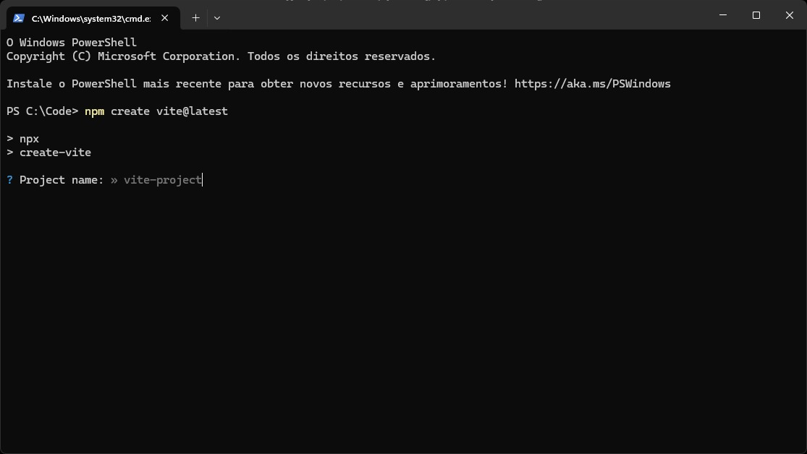
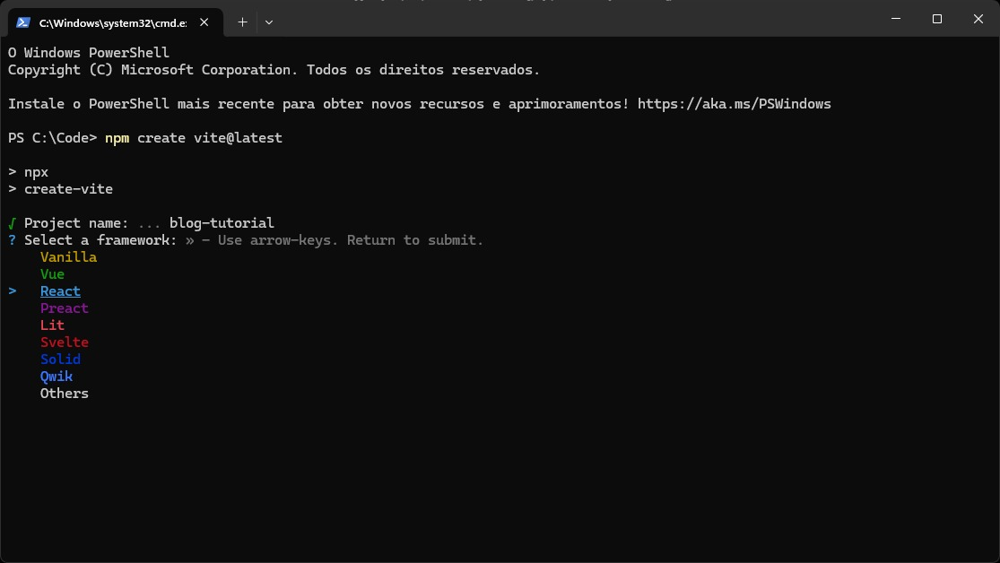
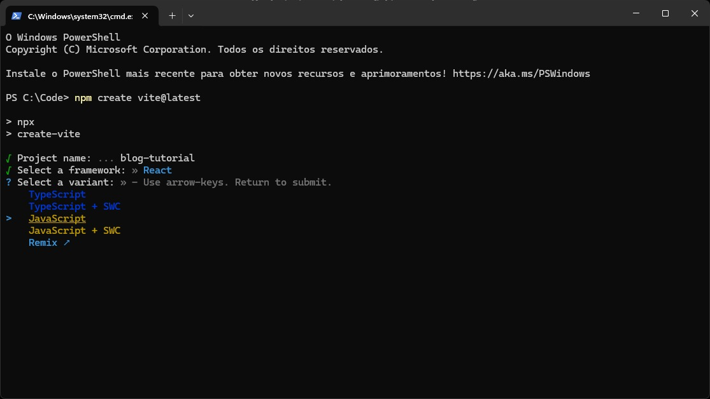
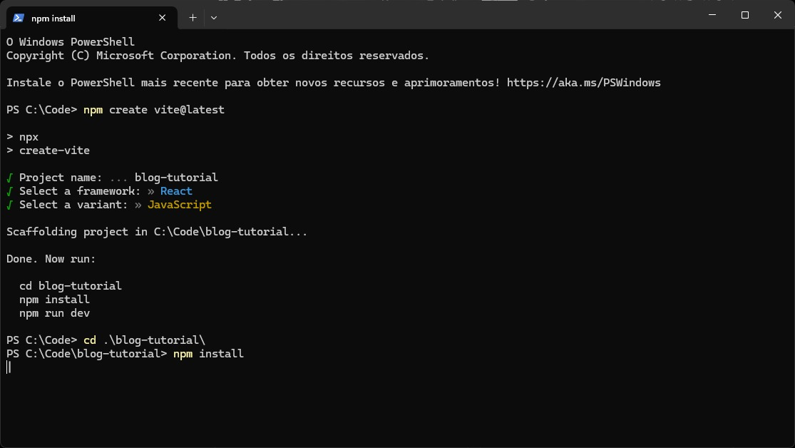
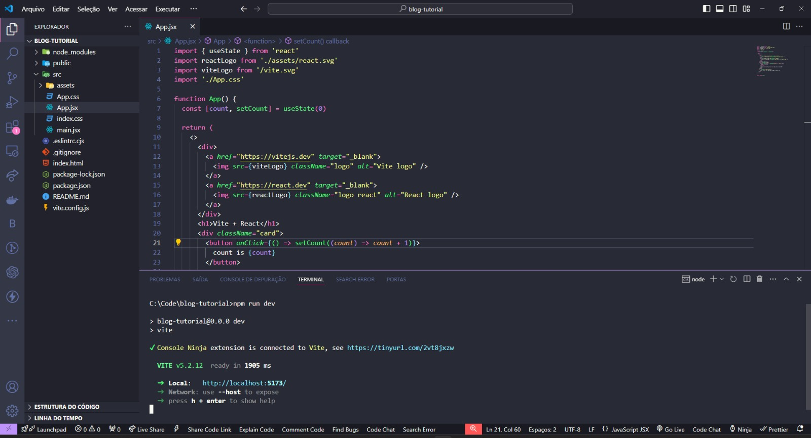
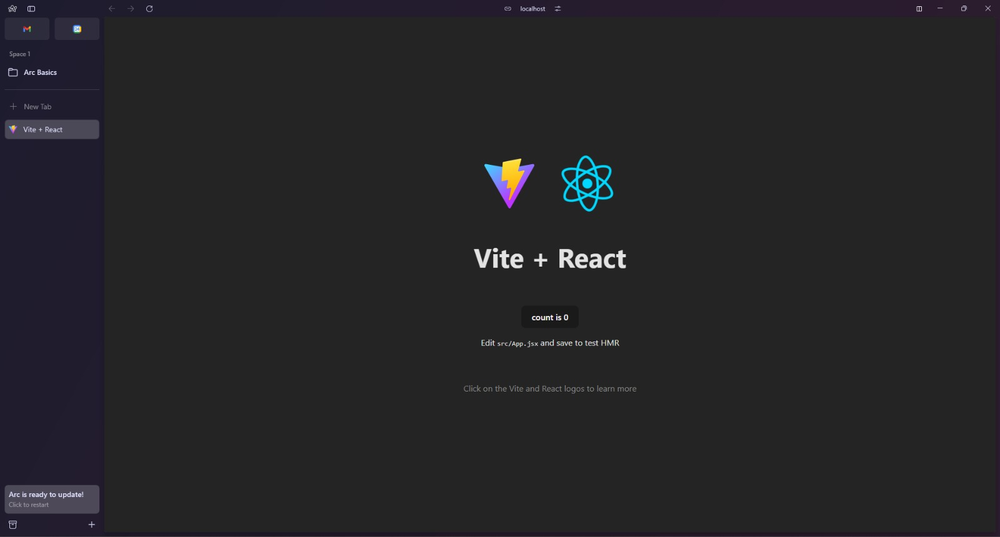

Vite.js é uma ferramenta de desenvolvimento web rápida, leve e flexível, especialmente adequada para projetos React. Neste artigo, exploraremos como iniciar e desenvolver projetos React com Vite.js, destacando suas vantagens, configurações básicas e recursos avançados.

## O que é Vite.js?
Vite.js é uma ferramenta de construção de aplicações web extremamente rápida e leve, desenvolvida com base no ecossistema do JavaScript moderno. Ele se destaca por sua inicialização instantânea, recarregamento rápido e construção eficiente de produção. Vite.js suporta várias estruturas de frontend, incluindo React, Vue.js, Preact e outras.

### Por que usar Vite.js com React?
- **Inicialização Rápida**: Vite.js possui uma inicialização instantânea que permite um tempo de carregamento rápido, ideal para desenvolvimento ágil.
- **Recarregamento Rápido**: O recarregamento a quente _(hot reloading)_ oferecido pelo Vite.js atualiza o navegador automaticamente sempre que você faz alterações no código, proporcionando uma experiência de desenvolvimento fluida e sem interrupções.
- **Ecossistema Moderno**: Vite.js integra-se perfeitamente com o ecossistema moderno de ferramentas JavaScript, como ES modules, TypeScript, CSS Modules e mais.

## Criando um Projeto React com Vite.js
Para iniciar um novo projeto React com Vite.js, siga estas etapas:

### 1. Instalação do Vite.js
Você pode criar um novo projeto React com Vite.js usando `npm create vite@latest`, abra um terminal na pasta que você deseja fazer o projeto:

```bash
npm create vite@latest
```

Logo após isso, você será recebido com uma mensagem no terminal para escolher o nome do projeto. Escolha o nome que você desejar para o seu projeto.


### 2. Selecionando a tecnologia
Você verá no terminal diversas tecnologias, mas, nesse tutorial abordaremos somente o react com vite. Em um post futuro abordaremos como escolher a melhor tecnologia para seu projeto.


### 3. Escolhendo a linguagem
Você também se deparará com diversas variantes de JavaScript e TypeScript, porém, vamos escolher JavaScript por enquanto, mas sinta-se a vontade para escolher TypeScript se você dominar a tecnologia.


### 4. Baixando pacotes node
Agora que finalizamos o setup inicial, podemos baixar os módulos do node com as dependências de desenvolvimento com o comando `npm install` ou `npm i`:


### 5. Abrindo o projeto no vscode e rodando
Agora com as dependências instaladas, podemos dar o comando `code .` no nosso terminal para poder abrirmos o projeto direto no vscode. Você deve abrir a pasta _/src_ para ver os componentes e páginas da sua aplicação e no terminal devemos rodar o comando `npm run dev` para rodarmos nossa aplicação:
```bash
code .
```


```node
npm run dev 
```

Agora podemos ver nossa aplicação rodando no navegador, basta clicar com <kbd>CTRL</kbd>+<kbd>Click</kbd> para que seu navegador abra o link ou então você pode digitar na mão.



### Como posso progredir mais no React com vite?
Você pode conferir a documentação oficial no youtube ou até mesmo na documentação oficial do Vite, uma vez que ele tem suporte para vários frameworks. Maaaaas, como sou uma pessoa gentil e maravilhosa, estarei deixando abaixo um link de um tutorial de um projeto com vite e react para você começar a praticar e entender mais da tecnologia. 

[](https://www.youtube.com/live/-SDxID3BS4I?si=MAYfKqlq89zquSl-)