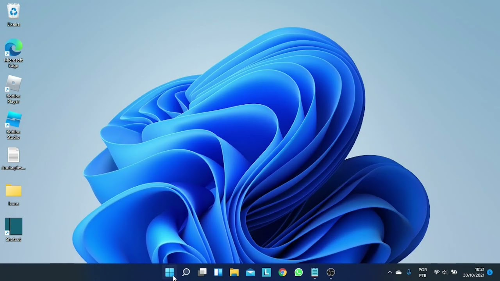
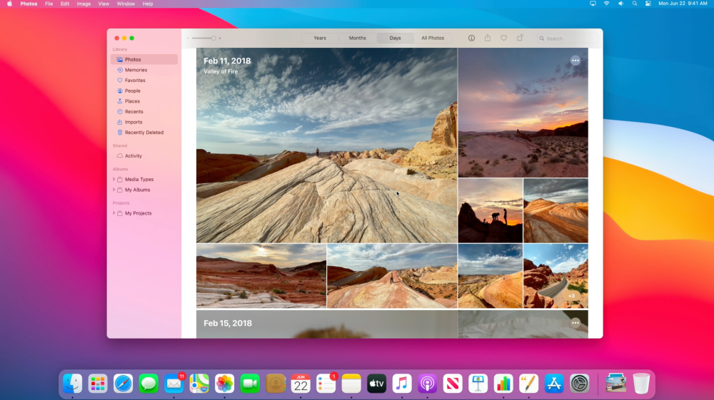
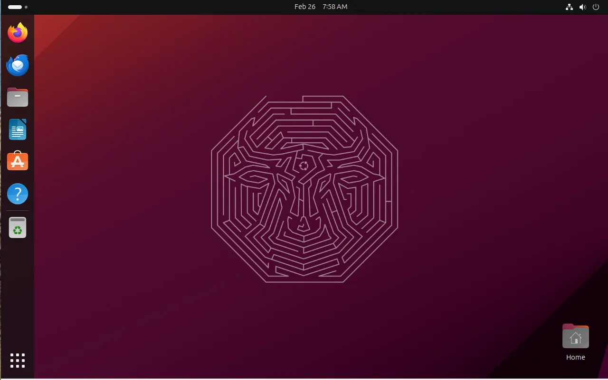

Escolher o sistema operacional (SO) certo para programar é uma decisão crucial que pode influenciar significativamente sua produtividade e experiência de desenvolvimento. Neste artigo, exploraremos as vantagens e desvantagens dos principais sistemas operacionais – Windows, macOS e Linux – para ajudar você a escolher o mais adequado às suas necessidades.

### O que é um Sistema Operacional?
Um sistema operacional é o software fundamental que gerencia o hardware do computador e fornece serviços essenciais para programas de aplicação. Ele atua como uma ponte entre o usuário e o hardware, facilitando a execução de tarefas e programas. Esse sistema pode ser desenvolvido em diversas linguagens como **C** no linux, C++ e Assembly no Windows e Objective-C com Swift para o MacOS, mas no final de tudo acabam caindo sempre na linguagem de máquina com 0 e 1, ou seja, linguagem binária. 

### Principais Sistemas Operacionais para Programar
#### Windows

##### Vantagens
1. Compatibilidade Ampla: Windows suporta uma vasta gama de softwares de desenvolvimento, desde editores de código a ferramentas de design.
2. Ferramentas da Microsoft: Disponibilidade de ferramentas poderosas como Visual Studio e .NET Framework.
3. Popularidade: Muito comum em ambientes corporativos, facilitando a integração com infraestruturas existentes.
##### Desvantagens
1. Custo: Licenças do Windows podem ser caras, especialmente para versões profissionais.
2. Segurança: Historicamente, Windows tem sido mais vulnerável a vírus e malwares.
3. Atualizações: As atualizações do Windows podem ser intrusivas e, às vezes, interromper o fluxo de trabalho.

#### MacOS

##### Vantagens
1. Ambiente Unix: macOS é baseado em Unix, o que facilita o desenvolvimento de software para ambientes Unix/Linux.
2. Ferramentas de Desenvolvimento da Apple: Ideal para desenvolvimento iOS e macOS com ferramentas como Xcode.
3. Estabilidade e Segurança: macOS é conhecido por sua estabilidade e robustez contra malwares.
##### Desvantagens
1. Custo: Os dispositivos Apple são significativamente mais caros que os PCs comuns.
2. Flexibilidade Limitada: Menos opções de hardware e personalização comparado ao Windows e Linux.
3. Compatibilidade: Alguns softwares e jogos podem não ser compatíveis com macOS.

#### Linux

##### Vantagens
1. Gratuito e Open Source: A maioria das distribuições Linux são gratuitas e de código aberto, oferecendo total liberdade e personalização.
2. Ambiente de Desenvolvimento: Perfeito para desenvolvimento de software de servidores e sistemas baseados em Unix.
3. Segurança: Menos suscetível a vírus e malwares, com uma forte comunidade focada em segurança.
##### Desvantagens
1. Curva de Aprendizado: Pode ser desafiador para iniciantes devido à necessidade de comandos de terminal e configuração manual.
2. Compatibilidade de Software: Alguns softwares proprietários não são suportados ou possuem suporte limitado.
3. Suporte Comercial: Menos suporte técnico comercial comparado ao Windows e macOS.

### Como Escolher o Melhor Sistema Operacional?
#### Defina Suas Necessidades
- Desenvolvimento Web: Todas as plataformas são adequadas, mas Linux e macOS são preferidos por seu ambiente Unix. Porém, o Windows não vai te limitar muito se você for desenvolver para Front-End.
- Desenvolvimento de Aplicativos Móveis: macOS é obrigatório para desenvolvimento iOS, mas Windows e Linux são bons para Android.
- Jogos e Desenvolvimento de Jogos: Windows é a melhor escolha devido à sua compatibilidade com ferramentas e motores de jogos.

#### Considere Seu Orçamento
- Gratuito ou Baixo Custo: Linux é a escolha óbvia.
- Investimento em Hardware: Se estiver disposto a investir, um Mac oferece um ambiente de desenvolvimento robusto para várias plataformas.

#### Pense na Curva de Aprendizado
- Facilidade de Uso: Windows é mais amigável para iniciantes.
- Experiência Técnica: Se você tem experiência técnica e gosta de personalização, Linux pode ser ideal.

#### Ferramentas e Ecossistema
- Ferramentas Específicas: Escolha um SO que suporte as ferramentas essenciais para o seu trabalho.

### Conclusão
A escolha do sistema operacional para programar depende de vários fatores, incluindo o tipo de desenvolvimento que você faz, seu orçamento e sua familiaridade com o sistema. Avalie cuidadosamente as vantagens e desvantagens de cada opção e selecione aquela que melhor atende às suas necessidades.

Vou deixar abaixo alguns vídeos de opiniões de outros devs sobre qual sistema usar para desenvolver. Até a próxima ^-^.

