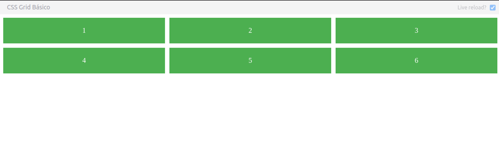
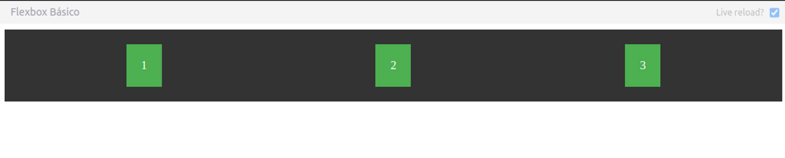
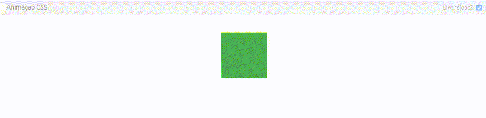
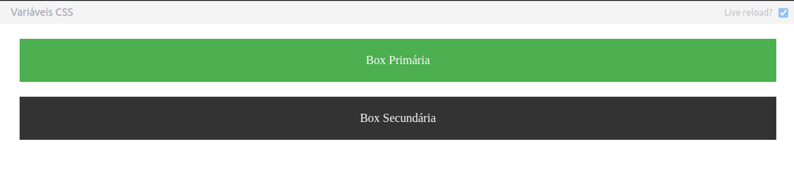
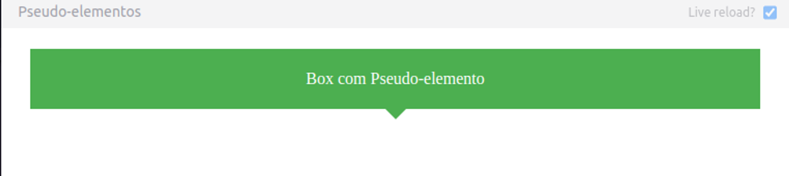
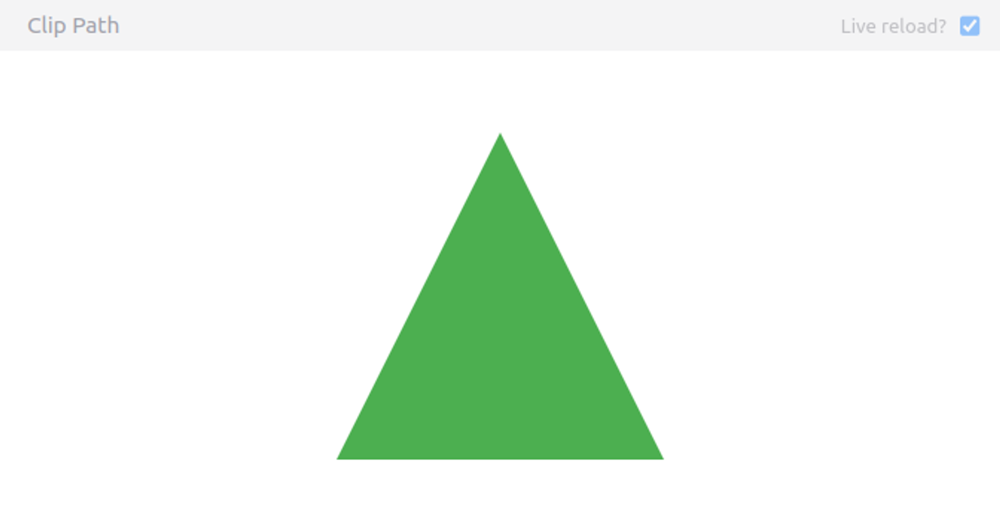
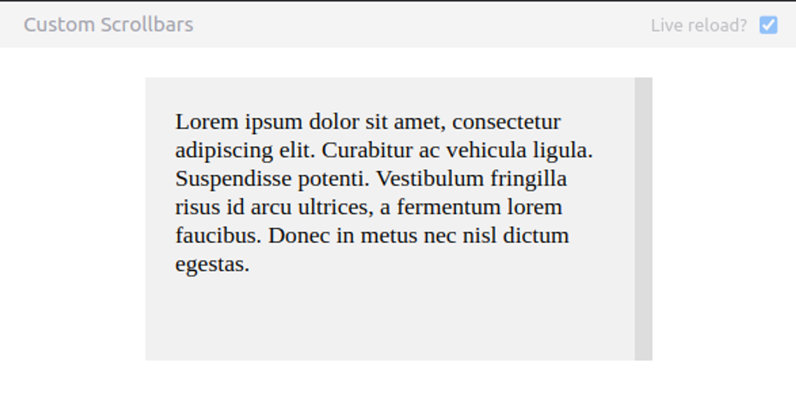

Neste guia, exploraremos técnicas avançadas de CSS que vão além do básico. Veremos como usar CSS Grid, Flexbox, animações, variáveis CSS, pseudo-elementos e muito mais. Cada técnica será acompanhada de exemplos práticos para você testar e visualizar os resultados.

### 1. CSS Grid
CSS Grid é uma poderosa ferramenta para criar layouts complexos de maneira simples e eficiente.

**Exemplo de Grid Básico:**

```html
<!DOCTYPE html>
<html lang="en">
<head>
    <meta charset="UTF-8">
    <meta name="viewport" content="width=device-width, initial-scale=1.0">
    <style>
        .grid-container {
            display: grid;
            grid-template-columns: repeat(3, 1fr);
            grid-gap: 10px;
        }
        .grid-item {
            background-color: #4CAF50;
            padding: 20px;
            color: white;
            text-align: center;
        }
    </style>
    <title>CSS Grid Básico</title>
</head>
<body>
    <div class="grid-container">
        <div class="grid-item">1</div>
        <div class="grid-item">2</div>
        <div class="grid-item">3</div>
        <div class="grid-item">4</div>
        <div class="grid-item">5</div>
        <div class="grid-item">6</div>
    </div>
</body>
</html>
```
**Resultado**


### 2. CSS Flexbox
Flexbox é ideal para criar layouts flexíveis e responsivos.

**Exemplo de Flexbox Básico:**

```html
<!DOCTYPE html>
<html lang="en">
<head>
    <meta charset="UTF-8">
    <meta name="viewport" content="width=device-width, initial-scale=1.0">
    <style>
        .flex-container {
            display: flex;
            justify-content: space-around;
            background-color: #333;
            padding: 20px;
        }
        .flex-item {
            background-color: #4CAF50;
            padding: 20px;
            color: white;
            text-align: center;
        }
    </style>
    <title>Flexbox Básico</title>
</head>
<body>
    <div class="flex-container">
        <div class="flex-item">1</div>
        <div class="flex-item">2</div>
        <div class="flex-item">3</div>
    </div>
</body>
</html>
```
**Resultado**


### 3. Animações CSS
Animações em CSS podem adicionar interatividade e dinamismo ao seu site.

**Exemplo de Animação:**

```html
<!DOCTYPE html>
<html lang="en">
<head>
    <meta charset="UTF-8">
    <meta name="viewport" content="width=device-width, initial-scale=1.0">
    <style>
        .animated-box {
            width: 100px;
            height: 100px;
            background-color: #4CAF50;
            margin: 50px auto;
            animation: bounce 2s infinite;
        }
        @keyframes bounce {
            0%, 100% {
                transform: translateY(0);
            }
            50% {
                transform: translateY(-50px);
            }
        }
    </style>
    <title>Animação CSS</title>
</head>
<body>
    <div class="animated-box"></div>
</body>
</html>
</html>
```
**Resultado**


### 4. Variáveis CSS
Variáveis CSS permitem que você armazene valores que podem ser reutilizados em todo o documento.

**Exemplo de Variáveis CSS:**

```html
<!DOCTYPE html>
<html lang="en">
<head>
    <meta charset="UTF-8">
    <meta name="viewport" content="width=device-width, initial-scale=1.0">
    <style>
        :root {
            --primary-color: #4CAF50;
            --secondary-color: #333;
            --padding: 20px;
        }
        .box {
            background-color: var(--primary-color);
            color: white;
            padding: var(--padding);
            text-align: center;
            margin: 20px;
        }
        .box-secondary {
            background-color: var(--secondary-color);
        }
    </style>
    <title>Variáveis CSS</title>
</head>
<body>
    <div class="box">Box Primária</div>
    <div class="box box-secondary">Box Secundária</div>
</body>
</html>
```
**Resultado**


### 5. Pseudo-elementos
Pseudo-elementos permitem que você estilize partes específicas de um elemento.

**Exemplo de Pseudo-elementos:**

```html
<!DOCTYPE html>
<html lang="en">
<head>
    <meta charset="UTF-8">
    <meta name="viewport" content="width=device-width, initial-scale=1.0">
    <style>
        .pseudo-box {
            position: relative;
            background-color: #4CAF50;
            color: white;
            padding: 20px;
            margin: 20px;
            text-align: center;
        }
        .pseudo-box::after {
            content: '';
            position: absolute;
            bottom: -10px;
            left: 50%;
            transform: translateX(-50%);
            width: 0;
            height: 0;
            border-left: 10px solid transparent;
            border-right: 10px solid transparent;
            border-top: 10px solid #4CAF50;
        }
    </style>
    <title>Pseudo-elementos</title>
</head>
<body>
    <div class="pseudo-box">Box com Pseudo-elemento</div>
</body>
</html>
```
**Resultado**


### 6. Layout Responsivo com Media Queries
Media queries permitem que você aplique estilos diferentes com base no tamanho da tela.

**Exemplo de Media Queries:**

```html
<!DOCTYPE html>
<html lang="en">
<head>
    <meta charset="UTF-8">
    <meta name="viewport" content="width=device-width, initial-scale=1.0">
    <style>
        .responsive-box {
            background-color: #4CAF50;
            color: white;
            padding: 20px;
            text-align: center;
            margin: 20px;
        }
        @media (max-width: 600px) {
            .responsive-box {
                background-color: #333;
            }
        }
    </style>
    <title>Media Queries</title>
</head>
<body>
    <div class="responsive-box">Redimensione a janela!</div>
</body>
</html>
```
**Resultado**


### 7. Clip Path
Clip path permite que você crie formas complexas cortando elementos.

**Exemplo de Clip Path:**

```html
<!DOCTYPE html>
<html lang="en">
<head>
    <meta charset="UTF-8">
    <meta name="viewport" content="width=device-width, initial-scale=1.0">
    <style>
        .clip-path-box {
            width: 200px;
            height: 200px;
            background-color: #4CAF50;
            clip-path: polygon(50% 0%, 100% 100%, 0% 100%);
            margin: 50px auto;
        }
    </style>
    <title>Clip Path</title>
</head>
<body>
    <div class="clip-path-box"></div>
</body>
</html>
```
**Resultado**


### 8.Customização de Scrollbars
Você pode estilizar barras de rolagem para melhor se adequar ao design do seu site.

**Exemplo de Customização de Scrollbars:**

```html
<!DOCTYPE html>
<html lang="en">
<head>
    <meta charset="UTF-8">
    <meta name="viewport" content="width=device-width, initial-scale=1.0">
    <style>
        .scroll-box {
            width: 300px;
            height: 150px;
            overflow-y: scroll;
            background-color: #f1f1f1;
            padding: 20px;
            margin: 20px auto;
        }
        .scroll-box::-webkit-scrollbar {
            width: 12px;
        }
        .scroll-box::-webkit-scrollbar-track {
            background: #ddd;
        }
        .scroll-box::-webkit-scrollbar-thumb {
            background: #4CAF50;
            border-radius: 6px;
        }
    </style>
    <title>Custom Scrollbars</title>
</head>
<body>
    <div class="scroll-box">
        Lorem ipsum dolor sit amet, consectetur adipiscing elit. Curabitur ac vehicula ligula. Suspendisse potenti. 
        Vestibulum fringilla risus id arcu ultrices, a fermentum lorem faucibus. Donec in metus nec nisl dictum egestas.
    </div>
</body>
</html>
```
**Resultado**

