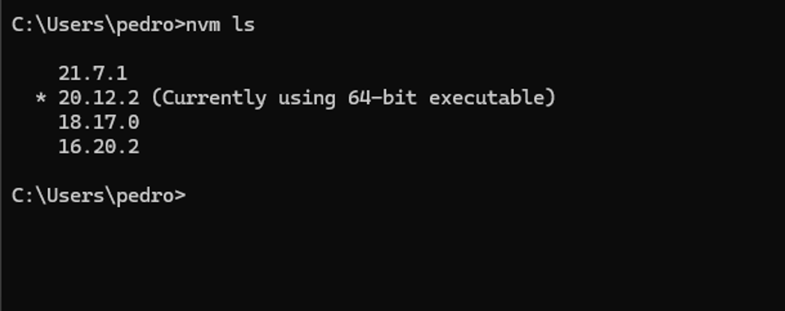

###### Autor: *[Pedro Henrique Melo](https://youtu.be/P5ZqFZKG4uE?si=OXqNtUg2lwQtD3jU)*
### **NVM: O Chapolin Colorado do Node.js**

Se você é desenvolvedor e já se pegou brigando com diferentes versões do Node.js, você sabe que essa luta pode ser mais difícil que convencer seu gato a não deitar no notebook enquanto você trabalha. Felizmente, existe um ser para salvar o dia: **NVM**, o Node Version Manager. Vamos explorar o que é o NVM, por que ele é importante e como você pode usá-lo para acabar de vez com seus problemas de versão do Node.js.

---

### **O que é o NVM?**

Imagine que você tem que preparar diferentes pratos na sua cozinha. Cada prato exige um fogão diferente, mas você só tem um fogão. A solução? Trocar de fogão rapidamente, sem destruir a cozinha (e sua paciência). É exatamente isso que o NVM faz, só que com versões do Node.js. Ele permite que você instale e troque entre diferentes versões do Node.js com a facilidade de quem troca de camiseta (esperamos que você troque de camiseta com frequência).

### **Por que o NVM é importante?**

**1. Manter a sanidade:**

- Já tentou rodar um projeto antigo com uma versão mais recente do Node.js e tudo desabou como um castelo de cartas? Com o NVM, você pode rodar cada projeto na sua versão específica do Node.js sem medo de quebrar tudo.

**2. Flexibilidade:**

- Precisa testar seu código em várias versões do Node.js? O NVM permite que você instale e use múltiplas versões, sem precisar configurar ambientes virtuais ou reformatar seu HD de desespero.

**3. Simplicidade:**

- Esqueça aquele cenário onde você precisa compilar manualmente uma versão específica do Node.js. O NVM faz isso para você, enquanto você se preocupa com coisas mais importantes, como pegar um café ☕.

### **Como instalar o NVM**

Antes de começar a usar essa maravilha, você precisa instalá-la. No Linux e no macOS, é só rodar o seguinte comando no terminal:

```bash
curl -o- https://raw.githubusercontent.com/nvm-sh/nvm/v0.39.3/install.sh | bash
```

Depois, carregue o NVM no seu terminal:

```bash
source ~/.nvm/nvm.sh
```

No Windows você precisa fazer o passo a passo padrão, que é: 

### 1. **Baixar o Instalador**

1. Vá para a [página de lançamentos do nvm-windows](https://github.com/coreybutler/nvm-windows/releases).
2. Baixe o arquivo `nvm-setup.zip` da última versão estável.

### 2. **Instalar o NVM**

1. Extraia o conteúdo do arquivo ZIP que você baixou.
2. Execute o arquivo `nvm-setup.exe` para iniciar o processo de instalação.
3. Siga as instruções do assistente de instalação:
    - Escolha o diretório de instalação do NVM.
    - Escolha o diretório onde o Node.js será instalado. Esse diretório será usado pelo NVM para gerenciar as versões do Node.js.

### **Usando o NVM como um mestre 🎲**

Agora que você instalou o NVM, vamos ao que interessa: como usá-lo para gerenciar as versões do Node.js.

**1. Instalar uma versão específica do Node.js:**

- Quer rodar aquele projeto que só funciona com o Node.js 16? Instale essa versão rapidinho:

```bash
nvm install 16 # sempre nesse parâmetro de nvm install <versão_do_node>
```

**2. Usar uma versão específica:**

- Para trocar entre as versões instaladas, é só usar:

```bash
nvm use 16 # sempre nesse parâmetro de nvm use <versão_do_node_que_você_baixou>
```

- Quer voltar para a versão mais recente que você instalou? Sem problemas:

```bash
nvm use node 
```

**3. Listar as versões instaladas:**

- Curioso para saber quais versões você já tem no seu sistema?

```bash
nvm ls
```



1. **Listar versões disponíveis:**
- Não sabe quais versões de node disponíveis? Veja com o comando abaixo:

```bash
nvm ls-remote
```

### **Problemas comuns (e como evitá-los)**

**1. O NVM não muda a versão:**

- Se você trocou a versão do Node.js com o `nvm use`, mas o comando `node -v` ainda mostra outra versão, pode haver outra instalação do Node.js fora do NVM. Remova-a ou ajuste seu PATH para priorizar o NVM.

**2. Erro ao instalar uma versão:**

- Se você encontrar erros ao instalar uma versão do Node.js, tente atualizar o NVM ou verificar se há dependências faltando no seu sistema.

---

### **Conclusão**

O NVM é uma ferramenta essencial para qualquer desenvolvedor que trabalha com Node.js. Ele simplifica a gestão de versões e permite que você rode múltiplos projetos sem se preocupar com conflitos de versão. Além disso, ele te traz paz de espírito, já que você nunca mais precisará chorar em posição fetal porque uma atualização do Node.js quebrou todos os seus projetos do nada.

Então, da próxima vez que seu colega de trabalho te ver alternando entre versões do Node.js sem quebrar nada, faça como os pinguins de madagascar e “Sorriam e acenem, rapazes”. 


image by: anonymously in funny GIFs

---

### Referências

- [GitHub do Projeto NVM](https://github.com/nvm-sh/nvm)
[](https://youtu.be/Zrq8reSxfUU?si=StsVejdV7QD_H8ay)
