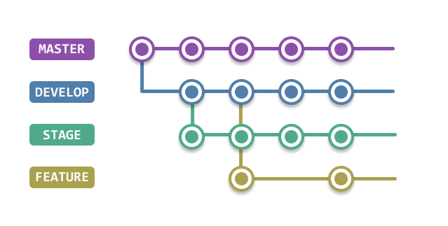

###### Autor: *[Pedro Henrique Melo](https://www.linkedin.com/in/pedro-henrique-melo-da-silva-a7a700231)*
### **GitFlow**

Se você é do tipo de programador que faz os projetos direto na branch `Main`, não sabe para que servem os merges ou como funciona a organização de grandes projetos profissionais, esse post é pra você. 

---

### **O que é o GitFlow?**

O GitFlow é uma estratégia de branching para Git, criada por Vincent Driessen, que ajuda a organizar e gerenciar o desenvolvimento de software, especialmente em projetos com múltiplos colaboradores. Esta abordagem define um modelo claro para a gestão de branches, tornando o processo de desenvolvimento mais estruturado e previsível. Um projeto normalmante possui diversas branches para poder manter o controle do software e dividir melhor as tarefas sem os desenvolvedores ficarem alterando infinitamente e perderem o controle do código.

### **Principais Branches no GitFlow**

O GitFlow define dois branches principais que estão sempre presentes no repositório:

1. **`development`** ou **`develop`**: Contém o código que está em desenvolvimento. É a próxima versão estável, onde novas funcionalidades e correções de bugs são integradas. Também é nessa branch que a Q.A (Quality Assurance) faz testes da aplicação, reporta bugs e devolve para que os programadores possam corrigir.
2. **`staging`**: É onde está a versão de código que o cliente pode realizar os testes da aplicação antes de ir para a produção.
3. **`master`** ou **`main`**: Contém o código que está em produção. É a versão estável do projeto.

Além dos branches principais, o GitFlow define branches de suporte que são criados e excluídos conforme necessário:

1. **`feature`**: Usado para desenvolver novas funcionalidades.
2. **`release`**: Usado para preparar uma nova versão para produção.
3. **`hotfix`**: Usado para aplicar correções urgentes em produção.
4. **`support`**: Utilizado para corrigir bugs em versões mais antigas.



### **E como o fluxo de trabalho no GitFlow funciona?**

1. **Iniciando um Novo Projeto**
    - O repositório é clonado.
    - As branches `master` e `development` são criados.
    - A branch `master` contém o código de produção.
    - A branch `development` é criado a partir do `master` e conterá o código em desenvolvimento.
    - A branch de `stagin` é criado a partir da `development`
    
2. **Desenvolvendo Novas Funcionalidades (Feature Branches)**
    - Um novo branch `feature` é criado a partir do branch `development`.
    - Nome do branch: `feature/nome-da-funcionalidade`
    - Desenvolvimento da nova funcionalidade acontece nesse branch.
    - Após o desenvolvimento, o branch `feature` é mesclado de volta ao branch `development` e, em seguida, deletado.

Exemplo: 
```bash
git checkout development
git checkout -b feature/nova-funcionalidade
# Desenvolver a funcionalidade
git checkout development
git merge feature/nova-funcionalidade
git branch -d feature/nova-funcionalidade
```

3. **Preparando uma Nova Versão (Release Branches)**
- Um novo branch `release` é criado a partir do branch `development`.
- Nome do branch: `release/v1.0.0`
- Ajustes finais e testes são feitos nesse branch.
- Após a preparação, o branch `release` é mesclado nos branches `master` e `development`, e em seguida, deletado.
- O branch `master` recebe um novo tag correspondente à nova versão.

Exemplo:

```bash
git checkout development
git checkout -b release/v1.0.0
# Preparar a versão
git checkout master
git merge release/v1.0.0
git tag v1.0.0
git checkout development
git merge release/v1.0.0
git branch -d release/v1.0.0
```

4. **Corrigindo Bugs em Produção (Hotfix Branches)**
- Um novo branch `hotfix` é criado a partir do branch `master`.
- Nome do branch: `hotfix/correção-crítica`
- A correção é desenvolvida nesse branch.
- Após a correção, o branch `hotfix` é mesclado nos branches `master` e `development`, e em seguida, deletado.
- O branch `master` recebe um novo tag correspondente à nova versão corrigida.

Exemplo:

```bash
git checkout master
git checkout -b hotfix/correção-crítica
# Desenvolver a correção
git checkout master
git merge hotfix/correção-crítica
git tag v1.0.1
git checkout development
git merge hotfix/correção-crítica
git branch -d hotfix/correção-crítica
```

### Benefícios do GitFlow

1. **Organização e Clareza**: O GitFlow fornece uma estrutura clara para gerenciar o desenvolvimento de software, facilitando a colaboração e o entendimento do estado do projeto.
2. **Desenvolvimento Paralelo**: Permite que várias funcionalidades e correções sejam desenvolvidas simultaneamente sem interferência.
3. **Gestão de Lançamentos**: Facilita a preparação e lançamento de novas versões, garantindo que apenas código estável chegue à produção.
4. **Manutenção de Produção**: Proporciona uma maneira estruturada de aplicar correções urgentes em produção sem interromper o desenvolvimento contínuo.
---

### Considerações Finais e Referências

Embora o GitFlow seja uma estratégia poderosa, pode ser excessivo para projetos menores ou equipes ágeis que preferem um fluxo de trabalho mais simples. É importante avaliar as necessidades do seu projeto e equipe para determinar se o GitFlow é a melhor abordagem.

- [GitFlow Documentation](https://www.atlassian.com/git/tutorials/comparing-workflows/gitflow-workflow)
