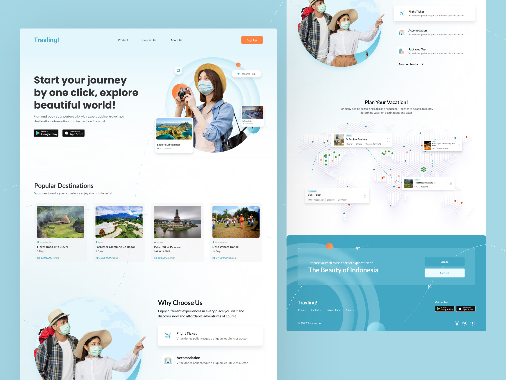

## 💻 Projeto

Este projeto é uma landing page **moderna** e **responsiva** para um site de viagens, desenvolvida com Next.js e Tailwind CSS. A página oferece uma experiência visualmente **atraente** com seções **destacadas** para destinos populares, **benefícios** dos serviços e um chamado à ação para **planejar** suas férias. Elementos interativos, **animações** suaves e ícones sociais completam o design, proporcionando uma navegação **intuitiva** e envolvente para os usuários.

- [Visite o projeto online](https://travelling-ivory.vercel.app/)

## 🚀 Tecnologias

Esse projeto foi desenvolvido com as seguintes tecnologias:

- NEXT 14
- Typescript
- Tailwind CSS
- Figma
- Muito café

## 🔖 Layout

Você pode visualizar o layout do projeto através [Desse Link](https://www.figma.com/community/file/1161298959495777934/travling-travel-website-landing-page?searchSessionId=lyvnl0lm-fc483ovp085). É necessário ter conta no [Figma](https://figma.com) para acessá-lo.
